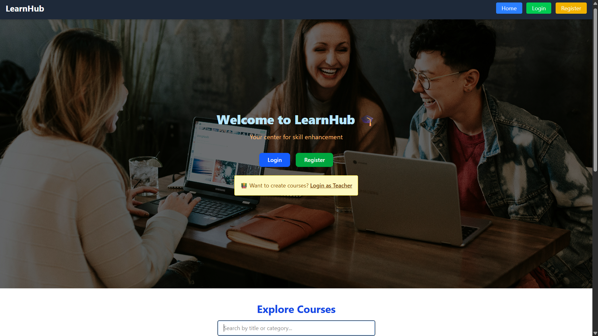
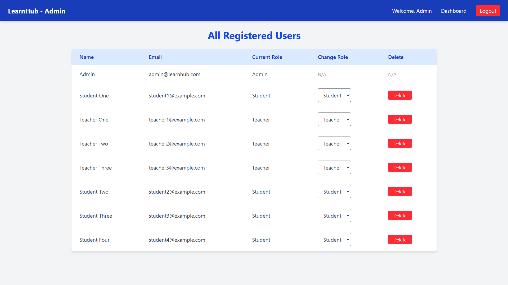
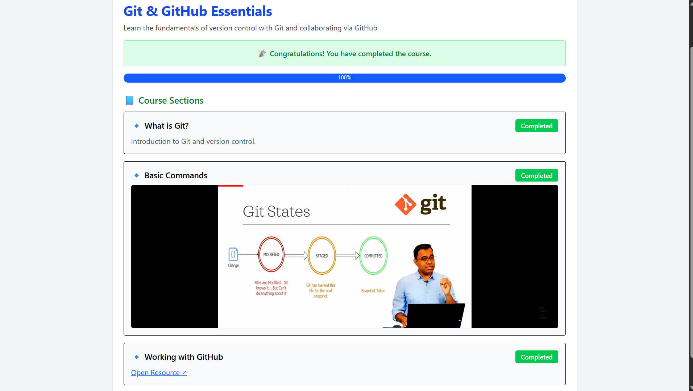
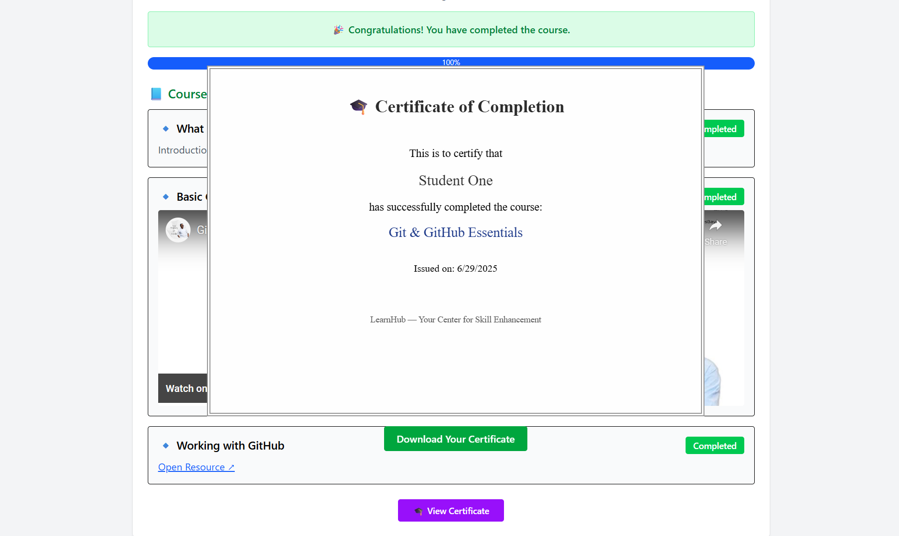

# LearnHub – Your Center for Skill Enhancement 🎓

This project was built as part of the **APSCHE Full Stack Internship Program**.  
LearnHub is a full-stack MERN platform that enables **Admins to manage users and courses**, **Teachers to create learning content**, and **Students to enroll, learn, and get course completion certificates**.

---

## 📄 Documentation

📎 [Download the full project report](https://drive.google.com/your-doc-pdf-link)

> Replace with your Google Drive PDF (or keep it local in the repo as `Documentation.pdf`)

---

## 🎬 Demo Video

📺 [Click here to watch the video demo](https://drive.google.com/your-demo-video-link)

> Replace this with your actual Drive video link (with view access)

---

## 🚀 Features

### 🔐 Authentication

- Role-based login: Admin, Teacher, Student
- Secure JWT-based authentication

### 🧑‍🏫 Teacher Module

- Create courses with title, price, description
- Add multiple course sections (with video/image & description)

### 🎓 Student Module

- Browse available courses
- Enroll in any course
- Start learning and view all sections
- Track section completion
- Unenroll from courses
- Download certificate after completing the course

### 🛠 Admin Module

- Manage all users (view, delete, update roles except Admins)
- Manage all courses (view and delete any course)

---

## 🧠 Technologies Used

- **Frontend**: React.js, Tailwind CSS, Vite
- **Backend**: Node.js, Express.js, MongoDB Atlas
- **Other**: Axios, React Router, JWT, html2canvas + jsPDF (for certificates)

---

## 📸 UI Screenshots

### 1. Login Page  



### 2. Admin Dashboard  



### 3. Student Learning Page  



### 4. Download Completion Certificate



---

## 🛠 How to Run Locally

To run this project on your local machine, follow the steps below:

### 🔹 1. Clone the Repository

```bash
git clone https://github.com/MylapalliYesebu/LearnHub-MERN-Internship.git
cd LearnHub-MERN-Internship
```

### 🔹 2. Setup Backend

```bash
cd backend
npm install
```

- Create a .env file inside /backend based on [.env.example](./backend/.env.example)
- Start the backend server:

```bash
npm run dev
```

- The backend will run at: [http://localhost:5000](http://localhost:5000)

### 🔹 3. Setup Frontend

```bash
cd frontend
npm install
```

- Create a .env file inside /frontend based on [.env.example](./frontend/.env.example)

- Start the frontend app:

```bash
npm run dev
```

- The frontend will run at: [http://localhost:5173](http://localhost:5173)

### 🔹 4. Requirements

- Make sure you have the following installed:

- Node.js (v16+ recommended)

- npm (comes with Node)

- MongoDB Atlas account (or local MongoDB)

---

## ❓ Need Help?

If you face any issues or have questions, please:

- Open an issue on [GitHub](https://github.com/MylapalliYesebu/LearnHub-MERN-Internship/issues)
- Or Gmail me at: [yesebumylapalli08@gmail.com](mailto:mylapalliyesebu@example.com)

---

## 🙋‍♂️ Developed By

- Mylapalli Yesebu
- B.Tech CSE, Ideal Institute of Technology, Kakinada
- GitHub: [MylapalliYesebu](https://github.com/MylapalliYesebu)

---
